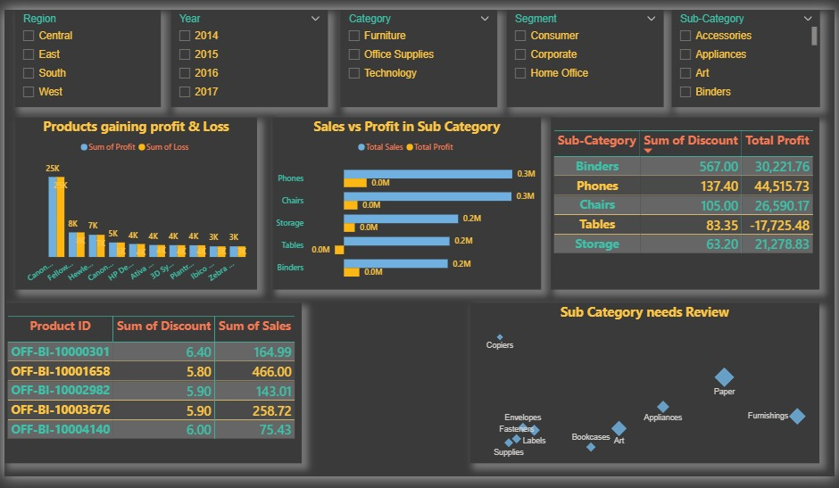

# Sales Dashboard – Overview of Sales and Profits

This is my **first Power BI dashboard**.  
It visualizes **sales and profit data** and highlights key business metrics.

## Insights Shown:
- Sales and profits yearly, region-wise, product-wise, customer-wise, and segment-wise  
- Which sub-category had high sales and low sales  
- Distribution of sales and profits across states

## Screenshot
![Sales Dashboard]
(IMG-20251227-WA0001.jpg)

